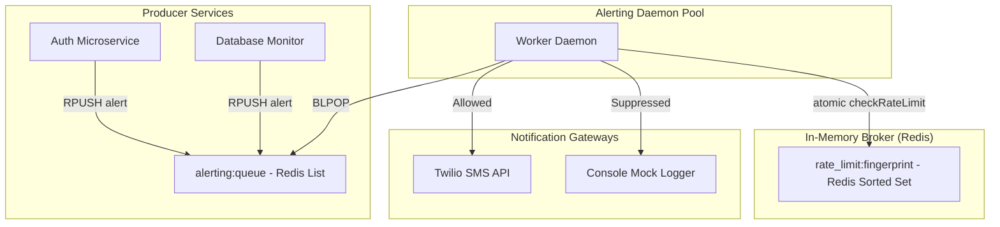

# Architecting a Resilient Distributed Alerting Pipeline with Redis Sliding-Window Rate Limiting and Twilio SMS

During a major outage—such as a primary database crash or network partition—systems degrade rapidly, emitting thousands of cascading error events per second. A naive alerting setup that listens to exception logs and pushes SMS notifications directly to Twilio will catastrophically fail. First, it will trigger Twilio’s API concurrency limits, queueing and delaying critical alerts. Second, it will incur massive API usage costs. Third, it will subject on-call engineers to "alert fatigue," blinding them to the root cause of the incident.

To solve this, we must build a decoupled, distributed alerting pipeline. This tutorial demonstrates how to architect a production-ready alerting service in TypeScript. It uses a **Redis Queue** for low-latency asynchronous processing, a **Redis Sorted Set (ZSET)** managed by an **atomic Lua script** to implement distributed sliding-window rate limiting, and the **Twilio SMS API** to deliver alerts with automatic sandbox simulation fallback.

---

## Architecture Overview

A reliable distributed alerting system separates the *detection* of an anomaly from the *notification* mechanism. We utilize an asynchronous worker pool pattern to handle high-throughput event spikes without choking downstream SMS gateways.



### Key Architectural Decisions

1. **Redis List (`BLPOP`) vs. Pub/Sub:** 
   Standard Redis Pub/Sub is "fire-and-forget" and lacks queue durability. If a worker pool crashes or restarts, all in-flight alerts are lost. By using a Redis List, we gain a durable queue where messages persist until a worker consumes them. We utilize `BLPOP` (Blocking Left Pop) to block the worker connection until an item is available, achieving sub-millisecond dispatch latency without CPU-heavy polling loops.
2. **Sliding-Window Log vs. Token Bucket:**
   Token Bucket algorithms work well for global API rate limiting, but they suffer from reset-boundary spikes and do not track the precise timestamps of individual alerts. The **Sliding Window Log** algorithm tracks every execution timestamp within a rolling window. This provides exact cooldown tracking, enabling us to tell an engineer precisely *when* their alerting block will clear.
3. **Atomic Lua Script Execution:**
   In a distributed environment where multiple worker instances pull from the queue, a naive "read current count, then conditionally increment" pattern introduces critical race conditions. We write our sliding-window logic in Lua and register it with Redis using `defineCommand`. Redis executes Lua scripts in a single-threaded block, ensuring our prune-and-check operations remain fully atomic across all cluster nodes.

---

## Prerequisites

To follow this tutorial, ensure your local environment contains:
* **Node.js**: v20.x or higher
* **TypeScript**: v5.x or higher
* **Redis**: v7.x or higher (A local server running on `127.0.0.1:6379`)
* **Twilio Account**: Optional (The codebase automatically falls back to an interactive console mock mode if placeholders are detected in `.env`)

### Project Dependencies

All dependencies are locked to exact versions inside `package.json`:

| Package | Version | Purpose |
| :--- | :--- | :--- |
| `ioredis` | `5.4.1` | High-performance Redis driver supporting Lua scripts and custom command definitions. |
| `twilio` | `5.13.1` | Official Twilio Node helper SDK for Programmable SMS. |
| `dotenv` | `16.4.5` | Strict configuration parsing from environment files. |
| `tsx` | `4.7.2` | High-speed TypeScript execution engine for development and testing. |

---

## Step-by-Step Implementation

### Step 1: Project Initialization

First, let's look at the configuration requirements for Node and TypeScript. The TypeScript compiler is configured in strict mode, targeting modern `ES2022` syntax.

Create `package.json`:

```json
{
  "name": "twilio-redis-alerting",
  "version": "1.0.0",
  "description": "Distributed Alerting Pipeline with Redis Pub/Sub, Sliding-Window Rate Limiting, and Twilio SMS",
  "main": "dist/worker.js",
  "scripts": {
    "build": "tsc",
    "worker": "tsx src/worker.ts",
    "publisher": "tsx src/publisher.ts",
    "test-pipeline": "tsx src/test-pipeline.ts"
  },
  "dependencies": {
    "dotenv": "16.4.5",
    "ioredis": "5.4.1",
    "twilio": "5.13.1"
  },
  "devDependencies": {
    "@types/node": "20.12.7",
    "tsx": "4.7.2",
    "typescript": "5.4.5"
  }
}
```

Create `tsconfig.json`:

```json
{
  "compilerOptions": {
    "target": "es2022",
    "module": "commonjs",
    "moduleResolution": "node",
    "lib": ["es2022"],
    "strict": true,
    "esModuleInterop": true,
    "skipLibCheck": true,
    "forceConsistentCasingInFileNames": true,
    "outDir": "./dist",
    "rootDir": "./src",
    "resolveJsonModule": true
  },
  "include": ["src/**/*"],
  "exclude": ["node_modules", "dist"]
}
```

---

### Step 2: Declare Domain Types

Define the data structures representing alert payloads and rate limiter states. We define a unique `fingerprint` string for each alert. This fingerprint serves as our partitioning key for rate-limiting (e.g., grouping database errors separately from web frontend warnings).

Create `src/types.ts`:

```typescript
export type AlertSeverity = 'INFO' | 'WARNING' | 'CRITICAL';

export interface AlertEvent {
  id: string;         // Unique event UUID
  source: string;     // Generating microservice (e.g. 'auth-service')
  severity: AlertSeverity;
  message: string;    // Raw error details
  timestamp: number;  // Unix epoch timestamp in milliseconds
  fingerprint: string; // Incident signature for rate-limiting segregation
}

export interface RateLimitConfig {
  windowSeconds: number; // Duration of the sliding window
  maxRequests: number;   // Maximum allowed executions within the window
}

export interface RateLimitResult {
  allowed: boolean;
  currentCount: number;
  ttlRemaining: number; // Time remaining (seconds) until the rate-limiter cooldown expires
}
```

---

### Step 3: Configure Environment Loading

The configuration manager loads variables from the `.env` file, validates presence, and exports type-safe environment parameters. It also detects whether the user is utilizing default Twilio sandbox credentials to handle the simulation mode fallback.

Create `src/config.ts`:

```typescript
import dotenv from 'dotenv';
import path from 'path';

// Force absolute path resolution to guarantee config loading regardless of run directories
dotenv.config({ path: path.resolve(__dirname, '../.env') });

function getEnvOrThrow(name: string): string {
  const value = process.env[name];
  if (!value) {
    throw new Error(`CRITICAL: Environment variable '${name}' is missing.`);
  }
  return value;
}

const rawAccountSid = getEnvOrThrow('TWILIO_ACCOUNT_SID');
const rawAuthToken = getEnvOrThrow('TWILIO_AUTH_TOKEN');

// Evaluate if credentials are the default placeholders
const isTwilioMock = 
  rawAccountSid.startsWith('ACXXXXXXXXXXXXXXXXXXXXXXXXXXXXXXXX') || 
  rawAuthToken === 'your_auth_token_here';

export const config = {
  twilio: {
    accountSid: rawAccountSid,
    authToken: rawAuthToken,
    phoneNumber: getEnvOrThrow('TWILIO_PHONE_NUMBER'),
    isMock: isTwilioMock,
  },
  alert: {
    recipientPhoneNumber: getEnvOrThrow('ALERT_RECIPIENT_PHONE_NUMBER'),
    // Limit alerts of a single fingerprint to max 3 per 60 seconds
    windowSeconds: 60,
    maxRequests: 3,
  },
  redis: {
    url: getEnvOrThrow('REDIS_URL'),
    queueKey: 'alerting:queue',
  },
};
```

---

### Step 4: Implement the Redis Sliding-Window Rate Limiter

We implement the rate limiter using a Redis Sorted Set (ZSET). The key of the ZSET is built around the alert fingerprint. 
* The **score** represents the millisecond timestamp when the alert arrived.
* The **member** value is the unique `id` of the alert. (Using the unique alert ID instead of the timestamp prevents concurrent alerts arriving at the same millisecond from overwriting each other).

The logic runs atomically in Redis via a Lua script loaded via `ioredis.defineCommand`:

Create `src/limiter.ts`:

```typescript
import Redis from 'ioredis';
import { RateLimitConfig, RateLimitResult } from './types';

// Extend ioredis client definition to support type-safe execution of our custom Lua command
declare module 'ioredis' {
  interface Redis {
    checkRateLimit(
      key: string,
      now: string,
      windowMs: string,
      maxRequests: string,
      memberId: string
    ): Promise<[number, number]>;
  }
}

export class DistributedRateLimiter {
  private redis: Redis;

  constructor(redisClient: Redis) {
    this.redis = redisClient;

    // Register our custom Lua script command with ioredis
    this.redis.defineCommand('checkRateLimit', {
      numberOfKeys: 1,
      lua: `
        local key = KEYS[1]
        local now = tonumber(ARGV[1])
        local windowMs = tonumber(ARGV[2])
        local maxRequests = tonumber(ARGV[3])
        local memberId = ARGV[4]

        -- Prune logs older than current window boundary
        redis.call('ZREMRANGEBYSCORE', key, '-inf', now - windowMs)

        -- Determine volume of remaining requests
        local currentCount = redis.call('ZCARD', key)

        local allowed = 0
        if currentCount < maxRequests then
          -- Add request log with score = current time, member = unique ID
          redis.call('ZADD', key, now, memberId)
          -- Set TTL to match the window duration to prevent key accumulation
          redis.call('PEXPIRE', key, windowMs)
          currentCount = currentCount + 1
          allowed = 1
        end

        return {allowed, currentCount}
      `,
    });
  }

  /**
   * Check if a specific alert fingerprint is within limits
   * @param fingerprint Unique identifier of the alert type
   * @param config Configuration for the rate limit
   * @param alertId Unique alert identifier to act as member in the sorted set
   */
  public async check(
    fingerprint: string,
    config: RateLimitConfig,
    alertId: string
  ): Promise<RateLimitResult> {
    const key = `rate_limit:${fingerprint}`;
    const now = Date.now();
    const windowMs = config.windowSeconds * 1000;

    // Invoke the custom script command
    const [allowedRaw, currentCount] = await this.redis.checkRateLimit(
      key,
      now.toString(),
      windowMs.toString(),
      config.maxRequests.toString(),
      alertId
    );

    const allowed = allowedRaw === 1;

    // Calculate the remaining TTL of the oldest item in the set
    let ttlRemaining = config.windowSeconds;
    if (!allowed) {
      const oldestArray = await this.redis.zrange(key, 0, 0, 'WITHSCORES');
      if (oldestArray.length === 2) {
        const oldestTimestamp = parseInt(oldestArray[1], 10);
        const timePassed = now - oldestTimestamp;
        ttlRemaining = Math.max(0, Math.ceil((windowMs - timePassed) / 1000));
      }
    }

    return {
      allowed,
      currentCount,
      ttlRemaining,
    };
  }
}
```

---

### Step 5: Implement the Twilio SMS Gateway

The Twilio client wraps the official SDK and handles live connection errors. It switches automatically to a mock logger output if it detects sandbox credentials in the environment config.

Create `src/twilio.ts`:

```typescript
import twilio from 'twilio';
import { config } from './config';

export class TwilioService {
  private client: ReturnType<typeof twilio> | null = null;

  constructor() {
    if (!config.twilio.isMock) {
      try {
        this.client = twilio(config.twilio.accountSid, config.twilio.authToken);
      } catch (err: any) {
        console.error('Failed to initialize live Twilio client. Switching to mock mode.', err.message);
        config.twilio.isMock = true;
      }
    }
  }

  /**
   * Dispatches SMS alert notification
   * @param to Recipient phone number in E.164 format
   * @param body Text message body
   * @returns Twilio Message SID string
   */
  public async sendSms(to: string, body: string): Promise<string> {
    if (config.twilio.isMock || !this.client) {
      // Simulate network roundtrip latency
      await new Promise((resolve) => setTimeout(resolve, 150));
      const mockSid = `SMmock_${Math.random().toString(36).substring(2, 17)}`;
      console.log(
        `\x1b[36m[MOCK TWILIO SMS]\x1b[0m Sent Alert Message to \x1b[33m${to}\x1b[0m.\n` +
        `  Body: "${body}"\n` +
        `  SID: ${mockSid}`
      );
      return mockSid;
    }

    try {
      const message = await this.client.messages.create({
        body,
        from: config.twilio.phoneNumber,
        to,
      });

      if (!message.sid) {
        throw new Error('Twilio response did not contain a Message SID.');
      }

      return message.sid;
    } catch (error: any) {
      const errorCode = error.code || 'UNKNOWN';
      const errorMessage = error.message || 'No details provided';
      
      console.error(
        `\x1b[31m[TWILIO ERROR]\x1b[0m Failed SMS delivery to ${to}. ` +
        `Code: ${errorCode} - Message: ${errorMessage}`
      );

      throw new Error(`Twilio dispatch failure: [${errorCode}] ${errorMessage}`);
    }
  }
}
```

---

### Step 6: Create the Alert Processing Worker Daemon

The worker process runs continuously. It opens two connections to Redis:
1. `redisBlocking`: Solely for execution of the blocking `BLPOP` call.
2. `redisMain`: Standard operations, including sliding window log checks.

We intercept `SIGINT` and `SIGTERM` signals to shut down the worker gracefully. The daemon closes the blocking connection immediately to abort any current wait, allows in-flight operations to execute, closes the main connection, and terminates.

Create `src/worker.ts`:

```typescript
import Redis from 'ioredis';
import { config } from './config';
import { DistributedRateLimiter } from './limiter';
import { TwilioService } from './twilio';
import { AlertEvent } from './types';

class AlertWorker {
  private redisMain: Redis;
  private redisBlocking: Redis;
  private limiter: DistributedRateLimiter;
  private twilio: TwilioService;
  private isShuttingDown = false;

  constructor() {
    this.redisMain = new Redis(config.redis.url);
    this.redisBlocking = new Redis(config.redis.url);
    
    this.limiter = new DistributedRateLimiter(this.redisMain);
    this.twilio = new TwilioService();

    this.setupErrorHandlers();
    this.setupSignalHandlers();
  }

  private setupErrorHandlers() {
    const logConnectionError = (type: string, error: any) => {
      console.error(`\x1b[31m[REDIS ERROR - ${type}]\x1b[0m Connection error:`, error.message);
    };

    this.redisMain.on('error', (err) => logConnectionError('MAIN', err));
    this.redisBlocking.on('error', (err) => logConnectionError('BLOCKING', err));
  }

  private setupSignalHandlers() {
    const shutdown = async (signal: string) => {
      if (this.isShuttingDown) return;
      this.isShuttingDown = true;
      
      console.log(`\n\x1b[33m[SHUTDOWN]\x1b[0m Received ${signal}. Cleaning up connections...`);
      
      // Terminate blocked connection
      this.redisBlocking.disconnect();
      
      // Let current commands finish, then quit main client
      await this.redisMain.quit();
      
      console.log('\x1b[32m[SHUTDOWN]\x1b[0m Clean shutdown complete.');
      process.exit(0);
    };

    process.on('SIGINT', () => shutdown('SIGINT'));
    process.on('SIGTERM', () => shutdown('SIGTERM'));
  }

  /**
   * Main polling loop using blocking pop to consume alerts
   */
  public async start() {
    console.log('\x1b[32m[WORKER]\x1b[0m Alert Worker Daemon initialized.');
    console.log(`[WORKER] Monitoring queue: "${config.redis.queueKey}"`);
    console.log(`[WORKER] SMS Mode: ${config.twilio.isMock ? 'SIMULATED' : 'LIVE'}`);
    console.log(`[WORKER] Recipient: ${config.alert.recipientPhoneNumber}`);
    console.log(`[WORKER] Rate limit rules: Max ${config.alert.maxRequests} per ${config.alert.windowSeconds}s per fingerprint.\n`);

    while (!this.isShuttingDown) {
      try {
        // BLPOP blocks connection until an item is pushed on the queue
        const result = await this.redisBlocking.blpop(config.redis.queueKey, 0);
        
        if (!result || this.isShuttingDown) continue;
        
        const [_, payload] = result;
        await this.processPayload(payload);
      } catch (error: any) {
        if (this.isShuttingDown) break;
        
        console.error('\x1b[31m[WORKER ERROR]\x1b[0m Error during polling loop:', error.message);
        // Exponential backoff to avoid hot-looping during DB outage
        await new Promise((resolve) => setTimeout(resolve, 2000));
      }
    }
  }

  private async processPayload(payload: string) {
    let alert: AlertEvent;
    
    try {
      alert = JSON.parse(payload);
    } catch (err) {
      console.error('\x1b[31m[WORKER ERROR]\x1b[0m Failed to parse alert payload JSON:', payload);
      return;
    }

    const start = Date.now();
    console.log(
      `\x1b[34m[PROCESSING]\x1b[0m Received alert [${alert.id}] ` +
      `Source: ${alert.source} | Severity: ${alert.severity} | Fingerprint: ${alert.fingerprint}`
    );

    try {
      // Evaluate rate limits
      const limitResult = await this.limiter.check(
        alert.fingerprint,
        { windowSeconds: config.alert.windowSeconds, maxRequests: config.alert.maxRequests },
        alert.id
      );

      if (!limitResult.allowed) {
        console.warn(
          `\x1b[33m[SUPPRESSED]\x1b[0m Alert [${alert.id}] throttled. ` +
          `Limit exceeded (${limitResult.currentCount}/${config.alert.maxRequests} in ${config.alert.windowSeconds}s). ` +
          `Cooldown remaining: ${limitResult.ttlRemaining}s`
        );
        return;
      }

      // Format alert message payload for SMS readability
      const smsBody = `Alert: [${alert.severity}] [${alert.source}] ${alert.message} (Ref: ${alert.id.substring(0, 8)})`;
      
      const messageSid = await this.twilio.sendSms(
        config.alert.recipientPhoneNumber,
        smsBody
      );

      const duration = Date.now() - start;
      console.log(
        `\x1b[32m[SUCCESS]\x1b[0m Alert [${alert.id}] processed. ` +
        `SMS SID: ${messageSid} | Limit status: ${limitResult.currentCount}/${config.alert.maxRequests} | Time: ${duration}ms`
      );
    } catch (err: any) {
      console.error(`\x1b[31m[PROCESSING FAILED]\x1b[0m Alert [${alert.id}] could not be completed:`, err.message);
    }
  }
}

const worker = new AlertWorker();
worker.start();
```

---

### Step 7: Build the Producer Publisher client

The producer represents a service that detects an anomaly and reports it. It generates a cryptographic UUID for the alert and calculates a SHA-256 fingerprint automatically if one is not provided.

Create `src/publisher.ts`:

```typescript
import Redis from 'ioredis';
import crypto from 'crypto';
import { config } from './config';
import { AlertEvent, AlertSeverity } from './types';

export class AlertPublisher {
  private redis: Redis;

  constructor() {
    this.redis = new Redis(config.redis.url);
    this.redis.on('error', (err) => {
      console.error('\x1b[31m[PUBLISHER REDIS ERROR]\x1b[0m', err.message);
    });
  }

  /**
   * Publishes an alert event to the centralized Redis queue
   * @param alert Details of the alert event
   * @returns Generated alert ID
   */
  public async publish(alert: {
    source: string;
    severity: AlertSeverity;
    message: string;
    fingerprint?: string;
  }): Promise<string> {
    const id = crypto.randomUUID();
    const timestamp = Date.now();
    
    // Auto-generate stable fingerprint if not provided (excludes dynamic message detail)
    const fingerprint = alert.fingerprint || 
      crypto.createHash('sha256')
        .update(`${alert.source}:${alert.severity}`)
        .digest('hex');

    const alertEvent: AlertEvent = {
      id,
      timestamp,
      fingerprint,
      source: alert.source,
      severity: alert.severity,
      message: alert.message,
    };

    const payload = JSON.stringify(alertEvent);
    
    // RPUSH pushes message onto the tail of the list queue
    await this.redis.rpush(config.redis.queueKey, payload);
    
    return id;
  }

  public async close() {
    await this.redis.quit();
  }
}

async function main() {
  const args = process.argv.slice(2);
  if (args.length === 0) {
    console.log(
      '\x1b[33m[USAGE]\x1b[0m npm run publisher <message> [severity] [source] [fingerprint]\n' +
      '  Default severity: CRITICAL\n' +
      '  Default source: auth-service\n' +
      '  Example: npm run publisher "Redis database connection timed out" CRITICAL backend-db\n'
    );
    process.exit(0);
  }

  const message = args[0];
  const severity = (args[1] || 'CRITICAL').toUpperCase() as AlertSeverity;
  const source = args[2] || 'auth-service';
  const fingerprint = args[3];

  const publisher = new AlertPublisher();
  try {
    const alertId = await publisher.publish({
      source,
      severity,
      message,
      fingerprint
    });

    console.log(
      `\x1b[32m[PUBLISHED]\x1b[0m Alert successfully queued.\n` +
      `  ID: ${alertId}\n` +
      `  Source: ${source}\n` +
      `  Severity: ${severity}\n` +
      `  Message: "${message}"`
    );
  } catch (error: any) {
    console.error('\x1b[31m[PUBLISH FAILED]\x1b[0m', error.message);
  } finally {
    await publisher.close();
  }
}

if (require.main === module) {
  main();
}
```

---

## Testing the Implementation

To test the system locally, we will execute a script that cleans existing keys in Redis and publishes a burst of 5 identical database failures along with 1 isolated out-of-memory alert.

Create `src/test-pipeline.ts`:

```typescript
import Redis from 'ioredis';
import { config } from './config';
import { AlertPublisher } from './publisher';

async function runTestSimulation() {
  console.log('\x1b[35m[TEST-RUNNER]\x1b[0m Connecting to Redis to reset pipeline state...');
  const redis = new Redis(config.redis.url);
  
  try {
    const keys = await redis.keys('rate_limit:*');
    if (keys.length > 0) {
      await redis.del(...keys);
    }
    await redis.del(config.redis.queueKey);
    console.log('\x1b[35m[TEST-RUNNER]\x1b[0m Cleaned up existing rate limits and queues.');

    const publisher = new AlertPublisher();

    console.log('\n\x1b[35m[TEST-RUNNER]\x1b[0m Publishing Alert Burst: 5 identical database failures...');
    
    // We send 5 database alerts. 1, 2, 3 should process; 4 and 5 must be throttled.
    const dbFingerprint = 'db_connection_fail';
    for (let i = 1; i <= 5; i++) {
      const alertId = await publisher.publish({
        source: 'database-cluster',
        severity: 'CRITICAL',
        message: `Connection pool exhausted - active connections > 100 [Burst #${i}]`,
        fingerprint: dbFingerprint,
      });
      console.log(`  -> Queued [Burst #${i}] ID: ${alertId}`);
    }

    console.log('\n\x1b[35m[TEST-RUNNER]\x1b[0m Publishing 1 alternative alert (OOM) with different fingerprint...');
    // This should immediately succeed, proving rate limit isolation per fingerprint
    const oomAlertId = await publisher.publish({
      source: 'web-server',
      severity: 'WARNING',
      message: 'Node process memory consumption exceeded 85%',
      fingerprint: 'oom_warning',
    });
    console.log(`  -> Queued [OOM] ID: ${oomAlertId}`);

    await publisher.close();
    console.log('\n\x1b[32m[TEST-RUNNER] Simulation payload successfully queued.\x1b[0m');
    
  } catch (error: any) {
    console.error('\x1b[31m[TEST-RUNNER ERROR]\x1b[0m Simulation run crashed:', error.message);
  } finally {
    await redis.quit();
  }
}

runTestSimulation();
```

### Execution Steps

1. Configure environment files. Copy `.env.example` to `.env` and configure your credentials, or keep default values to run mock simulations.
2. Open terminal #1 and spin up the worker daemon:
   ```bash
   npm run worker
   ```
3. Open terminal #2 and execute the load simulation pipeline runner:
   ```bash
   npm run test-pipeline
   ```

### Expected Output

In Terminal #1, you will observe the worker process:
1. Accept the first three database alerts and dispatch SMS notifications.
2. Successfully intercept and suppress the fourth and fifth database alerts, logging their cooldown status.
3. Deliver the isolated `oom_warning` alert without delay.

```text
[WORKER] Alert Worker Daemon initialized.
[WORKER] Monitoring queue: "alerting:queue"
[WORKER] SMS Mode: SIMULATED
[WORKER] Recipient: +1234567890
[WORKER] Rate limit rules: Max 3 per 60s per fingerprint.

[PROCESSING] Received alert [3a9bafff-5bdf-453a-b773-c570b2e3708b] Source: database-cluster | Severity: CRITICAL | Fingerprint: db_connection_fail
[MOCK TWILIO SMS] Sent Alert Message to +1234567890.
  Body: "Alert: [CRITICAL] [database-cluster] Connection pool exhausted - active connections > 100 [Burst #1] (Ref: 3a9bafff)"
  SID: SMmock_gdwxevvtzhl
[SUCCESS] Alert [3a9bafff-5bdf-453a-b773-c570b2e3708b] processed. SMS SID: SMmock_gdwxevvtzhl | Limit status: 1/3 | Time: 161ms

[PROCESSING] Received alert [c0abd8c4-843b-4e5c-9931-f4441033163f] Source: database-cluster | Severity: CRITICAL | Fingerprint: db_connection_fail
[MOCK TWILIO SMS] Sent Alert Message to +1234567890.
  Body: "Alert: [CRITICAL] [database-cluster] Connection pool exhausted - active connections > 100 [Burst #2] (Ref: c0abd8c4)"
  SID: SMmock_ph6x8t4oi4a
[SUCCESS] Alert [c0abd8c4-843b-4e5c-9931-f4441033163f] processed. SMS SID: SMmock_ph6x8t4oi4a | Limit status: 2/3 | Time: 152ms

[PROCESSING] Received alert [85ca145e-f3e5-492b-aa02-ef77832f149f] Source: database-cluster | Severity: CRITICAL | Fingerprint: db_connection_fail
[MOCK TWILIO SMS] Sent Alert Message to +1234567890.
  Body: "Alert: [CRITICAL] [database-cluster] Connection pool exhausted - active connections > 100 [Burst #3] (Ref: 85ca145e)"
  SID: SMmock_g19vyj1dd8s
[SUCCESS] Alert [85ca145e-f3e5-492b-aa02-ef77832f149f] processed. SMS SID: SMmock_g19vyj1dd8s | Limit status: 3/3 | Time: 153ms

[PROCESSING] Received alert [4527c927-2fa4-4237-ac71-0cd9770aeafb] Source: database-cluster | Severity: CRITICAL | Fingerprint: db_connection_fail
[SUPPRESSED] Alert [4527c927-2fa4-4237-ac71-0cd9770aeafb] throttled. Limit exceeded (3/3 in 60s). Cooldown remaining: 60s

[PROCESSING] Received alert [dd4aaaaa-24cb-45c6-bcb9-8dc912104429] Source: database-cluster | Severity: CRITICAL | Fingerprint: db_connection_fail
[SUPPRESSED] Alert [dd4aaaaa-24cb-45c6-bcb9-8dc912104429] throttled. Limit exceeded (3/3 in 60s). Cooldown remaining: 60s

[PROCESSING] Received alert [1a8c3303-85e3-438f-9995-88b27adf57d5] Source: web-server | Severity: WARNING | Fingerprint: oom_warning
[MOCK TWILIO SMS] Sent Alert Message to +1234567890.
  Body: "Alert: [WARNING] [web-server] Node process memory consumption exceeded 85% (Ref: 1a8c3303)"
  SID: SMmock_otr1bbue8j8
[SUCCESS] Alert [1a8c3303-85e3-438f-9995-88b27adf57d5] processed. SMS SID: SMmock_otr1bbue8j8 | Limit status: 1/3 | Time: 151ms
```

---

## Production Considerations

To deploy this alerting microservice to a high-scale production environment, consider the following hardening guidelines:

### 1. Transitioning to Redis Streams and Consumer Groups
While Redis Lists (`BLPOP`) are fast and lightweight, they lack features for distributed recovery. If a worker fetches a message from the queue and immediately crashes, the message is lost forever. 
To build a fault-tolerant pipeline, upgrade the queue from a Redis List to **Redis Streams** combined with **Consumer Groups (`XREADGROUP`)**. Redis Streams maintain a **Pending Entries List (PEL)**. If a worker retrieves an alert but fails to acknowledge it (`XACK`) within a specific time window, another worker can claim the alert and process it. This guarantees **at-least-once** delivery.

### 2. Hash Tags for Redis Clustering
When running in a partitioned Redis Cluster, keys are mapped to specific hash slots. If you evaluate a Lua script that references multiple keys (like a rate-limiting key and a tracking log), Redis will throw a `CROSSSLOT Keys in request don't map to the same slot` error if they are routed to different nodes.
To prevent this, use **Redis hash tags** `{...}` to force related keys onto the same node. For instance, format your keys as `{rate_limit:db_failure}` and `{rate_limit:db_failure}:metadata`. Redis will hash only the bracketed section, guaranteeing they reside on the same cluster host and enabling safe multi-key atomic transactions.

### 3. Asynchronous SMS Delivery Reconciliation
The HTTP request to `twilio.messages.create` only tells you that Twilio accepted your request—it does not guarantee the cellular network delivered the message. In production, you must track actual handoff. 
Provide a `statusCallback` URL parameter in your Twilio SMS dispatch configuration. Set up a lightweight public webhook endpoint (e.g. Express or Fastify on ECS/Lambda) to handle Twilio's asynchronous delivery updates (e.g., `sent`, `delivered`, `failed`, or `undelivered`). If a message status changes to `failed` (which can happen due to carrier filtering or invalid numbers), fallback to alternative channels like Slack webhooks or PagerDuty.

---

## Conclusion

We have engineered a robust, decoupled, and rate-limited alerting system in TypeScript. Rather than bombarding SMS gateways directly, microservices append events asynchronously to a Redis Queue. Dedicated workers process alerts sequentially, using an atomic Lua script to enforce sliding-window rate limits before invoking Twilio.

By decoupling components and using atomic distributed limiters, we protect both the on-call engineer's attention and the system's operational budget.